### Hi there 👋

These sort of profile READMEs [are overused](https://github.com/topics/github-config?o=desc&s=updated). Please stop using this format.

- 🔭 I’m currently working on abolishing this profile README format.
- 🌱 I’m currently learning to convince people to stop using this format.
- 👯 I’m looking to collaborate on stopping this README format.
- 🤔 I’m looking for help with abolishing this format.
- 💬 Ask me about getting rid of this README format
- 📫 How to reach me: Public email on my profile.
- 😄 Pronouns: He/him
- ⚡ Fun fact: I dislike this README format and would like to see more unique profile READMEs

